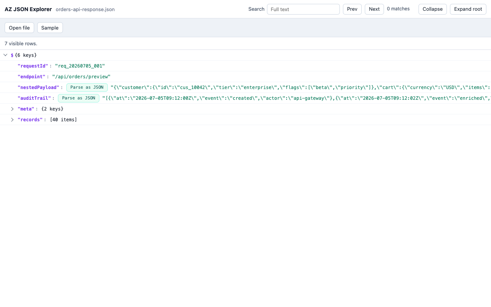

# AZ JSON Explorer

Fast Chrome MV3 JSON viewer for developers who inspect API responses, logs, fixtures, and local JSON files.

AZ JSON Explorer focuses on two problems that make JSON tools feel slow or awkward:

- Large JSON should stay responsive while parsing, searching, expanding, and scrolling.
- String fields that contain escaped JSON should be explorable in place with `Parse as JSON`, not copied into another tool.



## Why Use It

Many real API and log payloads contain values like this:

```json
{
  "event": "checkout",
  "payload": "{\"userId\":123,\"items\":[{\"sku\":\"A1\"}]}"
}
```

Most viewers stop at the escaped string. AZ JSON Explorer detects string values that look like JSON and shows `Parse as JSON` beside them. Clicking it parses that string into a normal expandable tree node, keeps the original string available, and lets you toggle between `parsed` and `raw`.

## Performance First

The viewer is built around a simple rule: the browser main thread should coordinate the UI, not do all the heavy JSON work.

- Root JSON parsing runs in a Web Worker.
- Nested `Parse as JSON` parsing runs in the same worker and is cached by path.
- Tree row preparation yields during large traversals instead of monopolizing the event loop.
- The UI uses virtual scrolling, so it renders only the rows visible in the viewport plus a small overscan buffer.
- Full-text search runs in the worker. Long string values are scanned in chunks.
- The standalone file-open path passes a `File` to the worker and does not mirror large file contents into the manual input textarea.

For very large local files, prefer the standalone viewer's `Open file` flow over opening a `file://` URL directly in Chrome. Direct file previews work, but the standalone file path avoids unnecessary page replacement overhead.

## Features

- Replaces raw JSON pages with an interactive tree viewer.
- Opens a standalone viewer from the extension popup.
- Supports manual paste, sample JSON, and local file loading.
- Shows `Parse as JSON` for string values whose trimmed content starts with `{` or `[`.
- Caches parsed nested string values and toggles them between `parsed` and `raw`.
- Supports expand/collapse, root expansion, path-aware row titles, and full-text search.
- Keeps JSON processing local in the browser. There is no backend service.

This project is intentionally not a JSON editor. It does not modify, upload, sync, or store your JSON on an external server.

## Install And Try

Install the published extension from the [Chrome Web Store](https://chromewebstore.google.com/detail/az-json-explorer/logkfmmknmmkpflgamhddeaedneaankj).

For local development, there is no build step. Chrome loads the repository files directly:

1. Clone or download this repository.
2. Open `chrome://extensions` in Chrome.
3. Enable `Developer mode`.
4. Click `Load unpacked`.
5. Select this repository folder.
6. Open a raw JSON URL, or click the extension action and choose `Open AZ JSON Explorer`.

To preview local `file://` JSON pages directly:

1. Open the extension details page in `chrome://extensions`.
2. Enable `Allow access to file URLs`.
3. Open a local `.json` file in Chrome.

To test without changing Chrome file permissions, use the extension popup:

1. Click the AZ JSON Explorer extension icon.
2. Choose `Open AZ JSON Explorer`.
3. Click `Sample`, paste JSON and click `Parse input`, or click `Open file`.

## Development

Install dependencies only if your environment needs them for npm scripts. The current project uses Node's built-in test runner.

```bash
npm test
```

Generate a large local fixture:

```bash
node fixtures/large-sample-generator.mjs 50000
```

Regenerate Chrome Web Store assets:

```bash
npm run store-assets
```

## Project Map

- `manifest.json`: Chrome MV3 extension manifest.
- `src/contentScript.js`: detects raw JSON pages and mounts the viewer iframe.
- `src/core/pageJsonDetection.js`: decides whether the current page is raw JSON.
- `src/viewer.html` and `src/viewer.js`: shared standalone and embedded viewer shell.
- `src/ui/viewerApp.js`: virtualized tree UI, user actions, search UI, and file/manual input flows.
- `src/worker/jsonWorker.js`: root parsing, nested string parsing, visible row collection, and search.
- `src/core/treeModel.js`: JSON tree row model.
- `src/core/parseCache.js`: parsed-string cache and `raw`/`parsed` display state.
- `test/*.test.mjs`: Node tests for parsing, tree, search, detection, and project-file invariants.

## Large JSON Notes

AZ JSON Explorer is designed for large payloads, but Chrome still has finite memory. A few implementation limits are intentional:

- Visible row preparation caps at 100,000 rows for a single expanded view.
- Search returns up to 500 matches at a time.
- Long strings are chunk-scanned to avoid one large blocking scan.

These limits keep the viewer predictable under load instead of trying to render or return everything at once.
