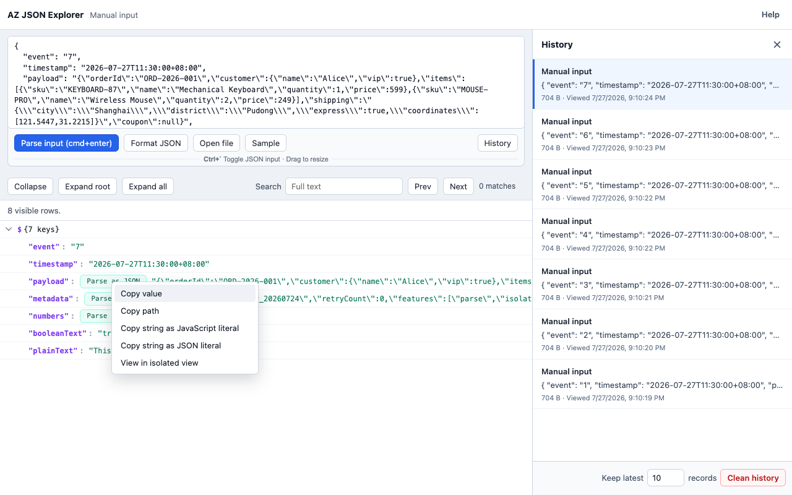

[English](README.md)

# AZ JSON Explorer

一款快速的 Chrome MV3 JSON 查看器，适合需要检查 API 响应、日志、测试数据和本地 JSON 文件的开发者。

[从 Chrome 应用商店安装 AZ JSON Explorer →](https://chromewebstore.google.com/detail/az-json-explorer/logkfmmknmmkpflgamhddeaedneaankj)

AZ JSON Explorer 专注于解决 JSON 工具中两个容易造成卡顿或操作不便的问题：

- 解析、搜索、展开和滚动大型 JSON 时，界面应始终保持流畅。
- 包含转义 JSON 的字符串字段应能直接通过“解析为 JSON”浏览，无需复制到其他工具。



## 为什么使用它

实际的 API 和日志数据中经常包含这样的值：

```json
{
  "event": "checkout",
  "payload": "{\"userId\":123,\"items\":[{\"sku\":\"A1\"}]}"
}
```

大多数查看器只会把它当作普通字符串。AZ JSON Explorer 会识别看起来像 JSON 的字符串，并在旁边显示“解析为 JSON”。点击后，该字符串会变成普通的可展开树节点，同时保留原始字符串，供你在“已解析”和“原始”模式之间切换。

## 性能优先

查看器遵循一个简单原则：浏览器主线程只负责协调界面，不承担所有繁重的 JSON 工作。

- 根 JSON 的解析在 Web Worker 中执行。
- 嵌套字符串的“解析为 JSON”也在同一个 Worker 中执行，并按路径缓存。
- 遍历大型数据时，树行准备过程会主动让出执行权，避免长时间占用事件循环。
- 界面使用虚拟滚动，只渲染视口内的行和少量预加载行。
- 全文搜索在 Worker 中执行，超长字符串会分块扫描。
- 独立查看器的文件打开流程会直接把 `File` 传给 Worker，不会把大型文件内容复制到手动输入框。

对于超大的本地文件，建议使用独立查看器中的“打开文件”，不要直接在 Chrome 中打开 `file://` URL。直接预览本地文件同样可用，但独立查看器可以避免额外的页面替换开销。

## 功能

- 将原始 JSON 页面替换为交互式树形查看器。
- 点击扩展图标直接打开独立查看器。
- 使用全局快捷键 `Ctrl+Shift+6` 打开新的独立查看器
  （macOS 上为 `Command+Shift+6`）。
- 支持手动粘贴、示例 JSON 和本地文件加载。
- 允许网页和其他 Chrome 扩展添加“在 AZ JSON Explorer 中打开”操作。
- 对去除首尾空白后以 `{` 或 `[` 开头的字符串显示“解析为 JSON”。
- 缓存嵌套字符串的解析结果，并可在“已解析”和“原始”模式之间切换。
- 支持展开/收起、根节点展开、路径感知的行标题和全文搜索。
- 支持英文和简体中文，并自动跟随 Chrome 的界面语言。
- 所有 JSON 处理都在浏览器本地完成，不依赖后端服务。

本项目有意不做 JSON 编辑器。它不会修改、上传、同步你的 JSON，也不会将其存储到外部服务器。

## 安装与试用

从 [Chrome 应用商店](https://chromewebstore.google.com/detail/az-json-explorer/logkfmmknmmkpflgamhddeaedneaankj)安装已发布的扩展。

本地开发无需构建步骤，Chrome 会直接加载仓库文件：

1. 克隆或下载本仓库。
2. 在 Chrome 中打开 `chrome://extensions`。
3. 启用“开发者模式”。
4. 点击“加载已解压的扩展程序”。
5. 选择本仓库目录。
6. 打开一个原始 JSON URL，或点击扩展图标打开独立查看器。

Chrome 运行时，也可以使用全局快捷键 `Ctrl+Shift+6`（macOS 上为
`Command+Shift+6`）打开新的独立查看器。你可以在
`chrome://extensions/shortcuts` 中重新设置该快捷键。

要直接预览本地 `file://` JSON 页面：

1. 在 `chrome://extensions` 中打开扩展的详情页。
2. 启用“允许访问文件网址”。
3. 在 Chrome 中打开本地 `.json` 文件。

如果不想修改 Chrome 的文件访问权限，可以使用独立查看器：

1. 点击 AZ JSON Explorer 扩展图标。
2. 点击“示例”，粘贴 JSON 后点击“解析输入”，或点击“打开文件”。

要从其他网页或 Chrome 扩展中打开 JSON，请参阅集成指南：
[English](docs/integrations/open-in-az-json-explorer.md) ·
[简体中文](docs/integrations/open-in-az-json-explorer.zh-CN.md)。

## 开发

仅当你的环境需要运行 npm 脚本时才需要安装依赖。当前项目使用 Node 内置的测试运行器。

```bash
npm test
```

生成大型本地测试数据：

```bash
node fixtures/large-sample-generator.mjs 50000
```

重新生成 Chrome 应用商店素材：

```bash
npm run store-assets
```

## 项目结构

- `manifest.json`：Chrome MV3 扩展清单。
- `src/contentScript.js`：检测原始 JSON 页面并挂载查看器 iframe。
- `src/core/pageJsonDetection.js`：判断当前页面是否为原始 JSON。
- `src/core/i18n.js` 和 `_locales/`：检测 Chrome 界面语言，并提供英文和简体中文文案。
- `src/viewer.html` 和 `src/viewer.js`：独立和嵌入式查看器共用的外壳。
- `src/ui/viewerApp.js`：虚拟化树形界面、用户操作、搜索界面及文件/手动输入流程。
- `src/worker/jsonWorker.js`：根 JSON 解析、嵌套字符串解析、可见行收集和搜索。
- `src/core/treeModel.js`：JSON 树的行模型。
- `src/core/parseCache.js`：字符串解析缓存及“原始”/“已解析”显示状态。
- `test/*.test.mjs`：解析、树模型、搜索、页面检测和项目文件约束的 Node 测试。

## 大型 JSON 说明

AZ JSON Explorer 面向大型数据设计，但 Chrome 的内存仍然有限。以下限制是有意设置的：

- 单个展开视图最多准备 100,000 个可见行。
- 每次搜索最多返回 500 个匹配项。
- 超长字符串会分块扫描，避免一次长时间阻塞。

这些限制可以让查看器在高负载下保持可预测，而不是试图一次渲染或返回所有内容。
